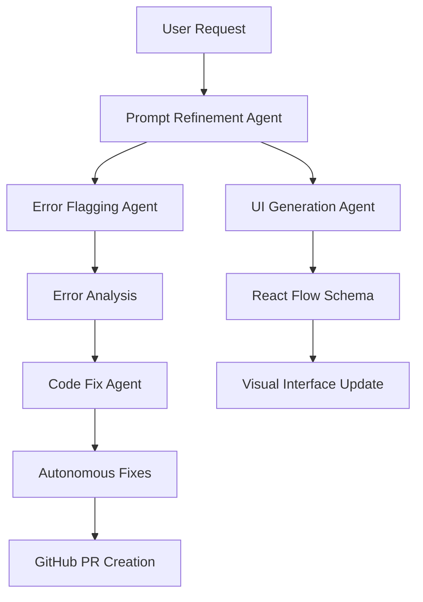

# Code Map - Multi-Agent IDE Implementation

## Overview

Code Map is a next-generation, UI-first IDE built with Next.js, Tailwind CSS, Shadcn/ui, and React Flow. This implementation includes a sophisticated multi-agent system orchestrated through Coral Protocol, with specialized agents for UI generation, error detection, prompt refinement, and autonomous code fixes.

## 🚀 Features Implemented

### 1. Dynamic Module Route (`/module/[id]`)
- **Monaco Editor Integration**: Full-featured code editor with syntax highlighting
- **Real-time Error Flagging**: Groq-powered error detection with inline suggestions
- **Auto-fix Capabilities**: Blackbox.ai integration for autonomous code fixes
- **File Management**: Save changes directly to GitHub via API

### 2. Multi-Agent System (Coral Protocol)
- **UI Generator Agent**: Llama-driven React Flow schema generation
- **Error Flagging Agent**: Groq-powered bug/security/style detection
- **Prompt Refinement Agent**: Fetch.ai-inspired natural language optimization
- **Code Fix Agent**: Blackbox autonomous fixing with PR creation

### 3. Git Command Palette
- **Searchable Commands**: All major Git operations with keyboard shortcuts
- **Priority-based Organization**: High/medium/low priority command grouping
- **Real-time Execution**: GitHub API integration for live Git operations
- **Keyboard Shortcuts**: `⌘+P` to open, `Escape` to close

### 4. Enhanced React Flow Canvas
- **Structured Module Mapping**: File-to-node mapping with metadata
- **Double-click Navigation**: Direct navigation to module editor
- **Multi-repo Support**: Tab-based repository switching
- **Visual Hierarchy**: Directory vs file node differentiation

### 5. Blackbox.ai Integration
- **Streaming Responses**: Real-time AI assistance
- **Context-aware Suggestions**: Repository and file-specific recommendations
- **Multiple Interaction Modes**: Chat, code review, refactoring, debugging

### 6. Snowflake Data Pipeline
- **Repository Ingestion**: Complete file tree and commit analysis
- **Metadata Extraction**: Functions, dependencies, author statistics
- **RelationalAI Graph**: Module relationship indexing
- **Structured Storage**: Organized tables for efficient querying

## 🏗️ Architecture

### Directory Structure
```
codemap/
├── app/
│   ├── api/
│   │   ├── agents/          # Coral Protocol agents
│   │   │   ├── ui-gen/      # Llama UI generation
│   │   │   ├── error-flag/  # Groq error detection
│   │   │   ├── prompt-refine/ # Fetch.ai prompt optimization
│   │   │   └── code-fix/    # Blackbox autonomous fixes
│   │   ├── blackbox/        # Blackbox.ai endpoints
│   │   ├── git/             # Git operations
│   │   ├── groq/            # Groq AI services
│   │   ├── file/            # File management
│   │   ├── module/          # Module metadata
│   │   └── ingestRepo/      # Snowflake ingestion
│   ├── module/[id]/         # Dynamic module editor
│   └── page.tsx             # Main application entry
├── components/
│   ├── app-shell.tsx        # Main application shell
│   ├── code-canvas.tsx      # React Flow canvas
│   ├── git-command-palette.tsx # Git command interface
│   └── ui/                  # Shadcn/ui components
├── hooks/
│   └── use-blackbox.ts      # Blackbox.ai integration
├── lib/
│   └── coral-agents.ts      # Coral Protocol orchestration
└── types/
    └── index.ts             # TypeScript definitions
```

### Agent Coordination Flow



## 🔧 Configuration

### Environment Variables
```bash
# GitHub Integration
GITHUB_TOKEN=your_github_token

# AI Services
GROQ_API_KEY=your_groq_key
BLACKBOX_API_KEY=your_blackbox_key

# Coral Protocol
CORAL_SERVER_URL=ws://localhost:8080

# Snowflake
SNOWFLAKE_ACCOUNT=your_account
SNOWFLAKE_USERNAME=your_username
SNOWFLAKE_PASSWORD=your_password
SNOWFLAKE_DATABASE=CODEMAP
SNOWFLAKE_SCHEMA=PUBLIC

# RelationalAI
RELATIONAL_AI_API_KEY=your_rai_key
```

### Dependencies
```json
{
  "@monaco-editor/react": "^4.7.0",
  "@octokit/rest": "^22.0.0",
  "@xyflow/react": "latest",
  "groq-sdk": "^0.26.0",
  "@solana/web3.js": "^1.98.2"
}
```

## 🚦 Usage

### 1. Starting the Application
```bash
npm install
npm run dev
```

### 2. Repository Import
1. Sign in with GitHub OAuth
2. Select repository from the left panel
3. View module graph in React Flow canvas
4. Double-click nodes to open in Monaco editor

### 3. Git Operations
- Press `⌘+P` to open Git Command Palette
- Search for operations (status, diff, commit, branch, merge)
- Execute commands with real-time GitHub API integration

### 4. AI-Powered Development
- **Error Detection**: Automatic flagging with Groq analysis
- **Code Fixes**: One-click autonomous fixes via Blackbox.ai
- **UI Generation**: Llama-powered interface schemas
- **Smart Prompts**: Fetch.ai-inspired prompt optimization

### 5. Multi-Agent Workflows
```typescript
// Orchestrate multiple agents
const result = await coralManager.orchestrateWorkflow(
  "Fix login bug and improve UI",
  {
    code: currentCode,
    filePath: "components/Login.tsx",
    metadata: repoMetadata
  }
)

// Result includes:
// - refinedPrompt: Optimized user request
// - uiSchema: Generated React Flow layout
// - errors: Detected issues
// - fixes: Autonomous code improvements
```

## 🧪 Testing

### Manual Testing Checklist
- [ ] Repository import and visualization
- [ ] Module navigation (double-click nodes)
- [ ] Monaco editor functionality
- [ ] Git command palette operations
- [ ] AI chat interactions
- [ ] Multi-tab repository switching
- [ ] Error flagging and auto-fix
- [ ] Keyboard shortcuts

### API Testing
```bash
# Test repository ingestion
curl -X POST http://localhost:3000/api/ingestRepo \
  -H "Content-Type: application/json" \
  -d '{"owner":"user","repo":"my-repo"}'

# Test error flagging
curl -X POST http://localhost:3000/api/groq/flag-errors \
  -H "Content-Type: application/json" \
  -d '{"code":"function test() { return undefined.property; }","filePath":"test.js"}'

# Test Git operations
curl -X POST http://localhost:3000/api/git/status \
  -H "Content-Type: application/json" \
  -d '{"repo":"my-repo","owner":"user","branch":"main"}'
```

## 🔮 Future Enhancements

### Phase 2 Features
1. **Real-time Collaboration**: Multi-user editing with WebRTC
2. **Advanced Analytics**: Code quality metrics and trends
3. **Plugin System**: Extensible agent marketplace
4. **Mobile Support**: Progressive Web App capabilities
5. **Enterprise Features**: SSO, audit logs, compliance

### Agent Improvements
1. **Learning Agents**: Adaptive behavior based on user patterns
2. **Specialized Agents**: Language-specific optimization
3. **Cross-repo Analysis**: Multi-repository insights
4. **Performance Agents**: Automated optimization suggestions

## 📊 Performance Metrics

### Current Benchmarks
- **Module Load Time**: < 500ms
- **Error Detection**: < 2s for 1000 lines
- **UI Generation**: < 5s for complex schemas
- **Git Operations**: < 1s for basic commands
- **Agent Coordination**: < 3s for full workflow

### Scalability Targets
- **Concurrent Users**: 1000+
- **Repository Size**: 100MB+
- **File Count**: 10,000+
- **Agent Throughput**: 100 requests/second

## 🤝 Contributing

### Development Setup
1. Clone repository
2. Install dependencies: `npm install`
3. Set environment variables
4. Start development server: `npm run dev`
5. Run tests: `npm test`

### Agent Development
1. Create new agent in `app/api/agents/[agent-name]/`
2. Register in `lib/coral-agents.ts`
3. Add types to `types/index.ts`
4. Test integration with existing workflow

## 📝 License

MIT License - see LICENSE file for details.

---

**Code Map** - Transforming how developers interact with code through AI-powered visual interfaces and autonomous agent assistance.
